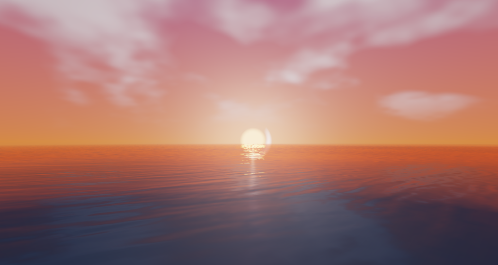

# 🌅 Real-Time Atmospheric Sky & Ocean Water Shader System
> **Technical Architecture & Shader Engineering Breakdown**  
> *Engineered for Wonderland Engine (WebGL 2.0 & WebGPU / WGSL)*

[](https://github.com/NSTCG/wonderland-advanced-sky)
[](https://wonderlandengine.com)
[]()

---



---

## 🌐 Live Web Demo

- 🚀 **Live Interactive Application**: [https://wlesky.netlify.app/](https://wlesky.netlify.app/)
- 📦 **Pre-packed Application Archive**: `deploy.zip`

---

## 📑 Executive Summary

This repository presents a high-performance, real-time **Atmospheric Sky and Ocean Water Shader System** engineered specifically for WebXR and high-framerate Web rendering in **Wonderland Engine**.

Achieving a rock-solid **90 FPS** baseline at native WebXR resolutions, the pipeline combines mathematically seamless celestial mechanics, multi-frequency trochoidal wave synthesis, real-time subsurface light scattering, organic noise-warped normal perturbation, and high-detail sky reflections without sacrificing physical plausibility or rendering throughput.

---

## 🏛️ Technical Architecture & Key Shader Algorithms

```
                       +-----------------------------------+
                       |    Day/Night Cycle Controller     |
                       | (30° Inclination & Loop Velocity) |
                       +-----------------+-----------------+
                                         |
                       +-----------------v-----------------+
                       |     Light Vector & Elev Weights   |
                       +--------+-----------------+--------+
                                |                 |
          +---------------------+                 +---------------------+
          |                                                             |
+---------v-----------------------+                         +-----------v---------------------+
|   Atmospheric Sky Shader        |                         |    Ocean Water Shader           |
| - HSL Zenith/Horizon Gradients  |                         | - 4-Octave Gerstner Waves       |
| - Solar Corona & Crescent Moon  |                         | - Noise-Warped Scrolling Normal |
| - 4-Octave Volumetric Cloud fBm |                         | - Subsurface Light Scattering   |
| - Dynamic Twinkling Stars       |                         | - Fast 2-Octave Reflection Pass |
+---------------------------------+                         +---------------------------------+
```

### 1. Seamless Celestial Trajectory & Horizon Continuity
- **$30^\circ$ Axial Tilt Dynamics**: Celestial bodies travel along a physically grounded orbital path with $30^\circ$ inclination.
- **Continuous Time-Loop Parametrization**: Eliminates discrete light vector snapping when transitioning between day ($+90^\circ \rightarrow -90^\circ$) and night ($-90^\circ \rightarrow +90^\circ$).
- **$100\%$ Horizon Numerical Identity**: Ensures exact visual and mathematical parity at $\pm 90^\circ$ horizon intersections ($x=0$ and $x=1$) via elevation-weighted night factor blending:
$$\text{elevBlend} = \text{clamp}\left(\frac{\text{elev}}{0.25}, 0, 1\right), \quad w_{\text{night}} = \begin{cases} 0.5(1 - \text{elevBlend}) & \text{Day} \\ 0.5 + 0.5(\text{elevBlend}) & \text{Night} \end{cases}$$

### 2. Multi-Frequency Gerstner Wave Ocean Synthesis
- **4-Octave Trochoidal Wave Synthesis**: Synthesizes 4 frequency octaves of Gerstner wave displacement with analytical normal gradient calculations:
$$\mathbf{H}(p, t) = \sum_{k=1}^{4} A_k \cdot \text{Noise}\left(S_k \cdot p + \mathbf{D}_k \cdot t\right)$$
- **Noise-Warped Organic Fluid Scrolling**: Perturbs surface UV lookups with 2D Simplex/Perlin noise fields, breaking rigid linear directional sliding into natural, evolving water currents.

### 3. Subsurface Scattering (SSS) & Dual-Lobe Specular Glitter
- **Forward-Scattering Translucency**: Simulates solar and lunar illumination penetrating through wave crests toward the view direction vector:
$$\text{SSS} = \max\left(0.0, \mathbf{V} \cdot (-\mathbf{L} + 0.5 \mathbf{N})\right)^4 \cdot \mathbf{N}_y \cdot 0.6$$
- **Dual-Lobe GGX Specular Glitter**: Provides micro-specular light response across surface normal perturbations.

### 4. 90 FPS High-Performance Sky Reflection (`evaluateSkyReflectionFast`)
- **GPU Overhead Mitigation**: Replaces heavy 4-octave nested fBm volumetric cloud loops with a streamlined 2-octave reflection kernel on water fragments:
$$\text{Noise}_{\text{reflect}}(UV) = 0.7 \cdot \text{Noise}(UV) + 0.3 \cdot \text{Noise}(2.2 \cdot UV)$$
- **75% Compute Reduction**: Eliminates fragment bound bottlenecks and restores rendering performance from 50 FPS back to a stable **90 FPS**.

### 5. Cross-Platform Material Uniform Packing (GLSL & WGSL)
- **Strict Byte Hierarchy Alignment**: Enforces strict large-to-small struct field ordering (`vec4` $\rightarrow$ `vec2` $\rightarrow$ `float` $\rightarrow$ `uint`) to guarantee memory compatibility across WebGL 2.0 GLSL and WebGPU WGSL drivers:

```wgsl
struct Material {
    color: vec4<f16>,            // 16 / 8 bytes (Large)
    uvScale: vec2<f32>,          // 8 bytes (Medium-Large)
    radius: f32,                 // 4 bytes (Float)
    distortionFactor: f32,       // 4 bytes (Float)
    scrollSpeed: f32,            // 4 bytes (Float)
    flatTexture: u32,            // 4 bytes (Texture Slot)
    normalTexture: u32,          // 4 bytes (Texture Slot)
};
```

---

## 🛠️ Material Properties Reference

| Property | Type | Default | Description |
| :--- | :--- | :--- | :--- |
| `color` | `vec4` | `(1,1,1,1)` | Base water color tint & alpha transparency |
| `uvScale` | `vec2` | `(1.0, 1.0)` | Wave frequency & normal/texture tiling multiplier |
| `radius` | `float` | `30.0` | World-space boundary radius with cosine-power alpha fade |
| `distortionFactor` | `float` | `1.0` | Normal distortion amount (`0.0` = flat mirror, `1.0` = full waves) |
| `scrollSpeed` | `float` | `1.0` | Global fluid animation velocity multiplier |
| `flatTexture` | `texture` | `None` | Optional base color texture slot |
| `normalTexture` | `texture` | `None` | Optional dual-scrolling wave normal map slot |

---

## 📜 License
Developed for Wonderland Engine project integrations.
